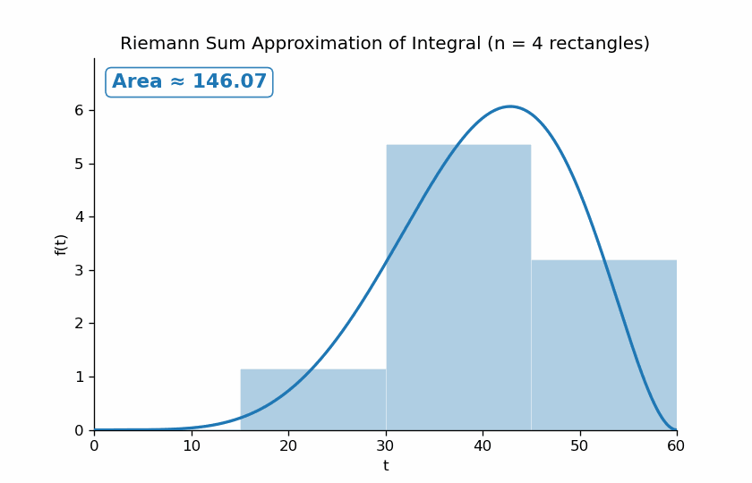

## Motivating Example

In each of the following situations, we want to compute the distance traveled by a person walking for 60 seconds.
In each part:

-   Sketch a plot of speed (on the y-axis) versus time (on the x-axis).
-   How is total distance traveled represented in this plot?
-   Compute the total distance traveled over 60 seconds.

1.  The person walks at a constant speed of 3 m/s for 60 seconds.
<div style="height: 4cm;"></div>

2.  The person walks at a constant speed of 3 m/s for the first 20 seconds and 5 m/s for the next 40 seconds. 
<div style="height: 4cm;"></div>

3.  Their speed at $t$ seconds is $0.1t$.
<div style="height: 4cm;"></div>

4.  Their speed at $t$ seconds is given by
$$
f(t) = 
\begin{cases}
0.2t, & 0<t<20,\\
4, & 20 < t < 40,\\
12-0.2t, & 40<t<60
\end{cases}
$$

<div style="height: 4cm;"></div>

5.  Suppose their speed at $t$ seconds is given by $400(t/60)^5(1-t/60)^2$.
How could you *approximate* the total distance traveled?
How could you get a better approximation?
<div style="height: 4cm;"></div>

```{python}
#| label: fig-speed
#| echo: false 
#| fig-cap: Plot of speed versus time. Area under the curve represents the total distance traveled over this time interval.

import numpy as np
import pandas as pd
from plotnine import *

def f(t):
    return 400 * (t / 60)**5 * (1 - t / 60)**2

t = np.linspace(0, 60, 6000)

df = pd.DataFrame({'t': t, 'y': f(t)})

(ggplot(df, aes('t', 'y'))
      + geom_area(fill='tab:blue', alpha=0.3)
      + geom_line(color='tab:blue', size=2)
      + labs(x = 'time (t)', y='Speed at time (t)')
      + theme_minimal())

```


## Integral

-   An integral is commonly interpreted as an [area under a curve](https://www.3blue1brown.com/?topic=calculus&lesson=integration)

    $$
    \int_a^b f(x) dx = \text{Area under curve $f$ over the interval $[a, b]$}
    $$
-   [Fundamental theorem of calculus](https://www.youtube.com/watch?v=rfG8ce4nNh0): If $F$ is a function whose derivative is $f$, that is $\frac{d}{dx} F(x) = f(x)$, then

    $$
    \int_a^b f(x)dx = F(b) - F(a)
    $$
-   You can [approximate an integral](https://en.wikipedia.org/wiki/Riemann_sum#Connection_with_integration) $\int_a^b f(x) dx$ by chopping the interval $[a, b]$ into many small intervals, and approximating the area under the curve with the sum of the areas of many narrow rectangles with heights specified by $f$.


::: {.content-visible unless-format="pdf"}

:::

## Integration in Python

```{python}
from sympy import integrate, Symbol

# Define the variable
t = Symbol('t')

# Define the function to integrate
ft = 0.1 * t

# Calculate the integral of 0.1t from 0 to 60
integrate(ft, (t, 0, 60))

```

```{python}
t = Symbol('t')

ft = 400 * (t / 60)**5 * (1 - t / 60)**2

integrate(ft, (t, 0, 60))
```


## From sums to integrals: averages of many values

Integrals have many applications, but one of the main applications we'll see in probability and statistics is that [integrals are related to averages](https://www.youtube.com/watch?v=FnJqaIESC2s). 
This section provides a very brief introduction; we'll see more details in GSB 5518.

Suppose you have 4 numbers: $0, 1, 2, 3$.

-   Sum: $0+1+2+3 = 6$
-   Average: $6/4 = 1.5$

Now suppose instead you have 101 numbers: $0, 1, 2, \ldots, 100$.

-   Sum: $0+1+2+\cdots+100 = 5050$
-   Average: $5050/101 \approx 50$

Same idea, just more terms---to compute the average, add them all up and divide by how many there are. 
We can represent this average in summation notation as

$$
\frac{1}{101}\sum_{x=0}^{100} x = \frac{0  + 1 + 2 + \cdots + 100}{101} = 50
$$

Now imagine, instead of the whole numbers $0, 1, 2, \ldots, 100$, *every* possible number between $0$ and $100$---not just whole numbers, but $0.001$, $12.7401$, $\sqrt{2}$, literally every value in between. There are uncountably many values, so "add them all up and divide by how many there are" doesn't even make sense anymore. 
So how can we compute an average value?

This is a situation an integral is built for. 
Two adjustments turn the discrete sum/average into a continuous one:

-   The sum $\sum_{x=0}^{100} x$ becomes the integral $\int_0^{100} x\, dx$
-   Dividing by "how many values" becomes dividing by the *length* of the interval, $100-0$

$$
\text{average value of } x \text{ on } [0,100] = \frac{1}{100-0}\int_0^{100} x\, dx
$$

```{python}
x = Symbol('x')

integrate(x, (x, 0, 100))
```

The integral $\int_0^{100} x\, dx = 5000$ so the average is $5000/100 = 50$, the same answer as averaging every whole number $0$ through $100$ above. That's not a coincidence: integrating is doing the same job as summing and dividing, just for a continuum of values instead of a finite list.


## Weighted sums and weighted averages


Suppose your course grade is based on 4 assignments with scores $x = [100, 70, 80, 90]$, but the assignments aren't weighted equally, they count for $10\%, 20\%, 30\%, 40\%$ of your grade, i.e., $w = [0.1, 0.2, 0.3, 0.4]$ (notice the weights add up to $1$).
Your course grade is a weighted average:

$$
0.1(100) + 0.2(70) + 0.3(80) + 0.4(90) = 84
$$

```{python}
import numpy as np

scores = np.array([100, 70, 80, 90])
weights = np.array([0.1, 0.2, 0.3, 0.4])

np.sum(weights * scores)
```

(You'll see this same setup again, written using vectors, in the matrix algebra material.)

Because the weights already add up to $1$, the weighted *sum* and the weighted *average* are the same computation --- there's no separate "divide by how many" step, since the weights already account for that.
(You can think of the regular unweighted average as a weighted sum where every weight is 1/4.)

Now suppose that instead of just 4 assignments you have infinitely many assignments (not very nice!) and you received every possible score from 0 to 100 exactly once.
(We'll see much more realistic examples later!).
As before, each assignment has a weight attached to it---some scores matter more than others, but the weights still have to "add up" to $1$ overall.
Since there are infinitely many possible scores, the "weight" isn't a list of numbers anymore; it's a function, say $f(x)$, telling you how much weight to put on the value $x$.
The requirement that the weights "add up to 1" is now expressed as an integral

$$
\int_0^{100} f(x)\, dx = 1
$$

The analog of the weighted sum $\sum_i x_i w_i$ is the  integral $\int_0^{100} x f(x)\, dx$. 
Just like before, since the weights already integrate to $1$, this is *also* the weighted average.

$$
\text{weighted average value of } x \text{ on } [0,100] = \int_0^{100} x f(x)\, dx
$$

**Example 1: equal weighting.**
If every value from $0$ to $100$ is weighted equally, the weight function is just the constant $f(x) = 1/100$ (so that $\int_0^{100} f(x)\, dx = 1$).

```{python}
f = 1 / 100

integrate(x * f, (x, 0, 100))
```

Same $50$ as before, equal weighting just gets you back to the plain average.

**Example 2: higher scores have more weight.**
Suppose instead $f(x) = 3x^2/1{,}000{,}000$ for $0 \le x \le 100$. 
This function is small near $x=0$ and largest near $x=100$, so it puts much more weight on high scores than low ones. First, check it's a valid weighting, i.e., that it integrates to $1$ over $[0,100]$.

$$
\int_0^{100} f(x)\, dx = \int_0^{100} 3x^2/1000000\, dx = 1
$$

```{python}
f = 3 * x**2 / 1000000

integrate(f, (x, 0, 100))
```

Now compute the weighted average of $x$. 

$$
\int_0^{100} xf(x)\, dx = \int_0^{100} x\left(3x^2/1000000\right)\, dx = 75
$$

::: {.callout-caution}
Be careful: this integral looks pretty similar to the integral we computed to check that the weights integrated to it, but don't forget the $x$ out front. 
The $x$ out front is playing a very important role: it's representing the actual *scores* you want to compute the weighted average of (like [100, 70, 80, 90]).
:::


```{python}
integrate(x * f, (x, 0, 100))
```

The weighted average comes out to $75$, considerably higher than the unweighted average of $50$, because the higher scores were weighted more heavily.

::: {.callout-note}
This idea---weighting values $x$ by a function and integrating $x$ times that function to get a weighted average---is exactly the calculation you'll do (with more formal language and in much more detail) when you compute **expected values** of continuous random variables in GSB 5518.
:::


## Online integration tools

-   [WolframAlpha](https://www.wolframalpha.com/calculators/integral-calculator?src=google&388=&gad_source=1&gad_campaignid=6479022389&gbraid=0AAAAAD032FmLiBFsBcYGNkroOhP5SJLlQ&gclid=Cj0KCQjwqebEBhD9ARIsAFZMbfwQ47v7QiJUcPv3oii4IQLTcsHpnP04H7O2j92dzwMu7jiUSjfk_90aAn08EALw_wcB)
-   [Symbolab](https://www.symbolab.com/solver/integral-calculator)
-   [Desmos](https://www.desmos.com/calculator/zv8ghd2hsj)
-   [3blue1brown videos](https://www.3blue1brown.com/?topic=calculus)

